# GetCongruentBranches
This is an overdue more user friendly version of the "congruent branches" method we introduced in [Carruthers et al. 2022](https://watermark.silverchair.com/syac012.pdf?token=AQECAHi208BE49Ooan9kkhW_Ercy7Dm3ZL_9Cf3qfKAc485ysgAAA1QwggNQBgkqhkiG9w0BBwagggNBMIIDPQIBADCCAzYGCSqGSIb3DQEHATAeBglghkgBZQMEAS4wEQQMLVRBxN_T1E4Rpid1AgEQgIIDB6mA6fJRWo2boKy27GOH_kNs6y5UIkAlQIlwMRMjtcP6Bg320GQYU-bj1nnyg46G77lmD-ivBGZBtzvMKkZ72Z0Iq8Z1VqaBZDsvbn1FCmcdvcCmhBNNL5XW5EZCLvCCvZUR6RZ4tBDbx73Fc1KxsbPo6_3l-Hep1g4UjSf0rF8zic2_DnwIQpMvaxnc0wBdV83OCZ1x9y5hwlg7HOAN2QwyhTQGAWrRLN-OjthkfT45GYa9TwkZ15cYVrpXsyYzFlmwlnCRrd9cEzTE5nH8Xau7nYjjOPwyId4dKtRJoi5s300OCuxl-tq6bS9L-4uFEriI7c6QYUV-868oLpVD85LKsEmry_ufAkJl-KziD26xskpkTRdHtESQwzCUxzfE-XXMFKdgCLqwg-M76raYsp_fwGby4fogmd_DF2N1DKd1-kWzIcm20iBeZH6XK6PuN0dUOEIZu5p6qhprKlnxoX6evypqNTiaQ_0kHjUoCR05jHv9MIa_R9_TlyLC48VJ50GueW3aSRykhHRnR-X-QyxVKAdu7ydH_JdETnNhKJnQZoFpkjBkFnX8GyzSSUi6vcjlFq9acXaXSWSNDcnqeg2wWQQMBlrSD_85Xps7igom-LQPLxQOBkFZjELbyaYXqJXjPYl-O9DfE17t_c8Z3MkmOIi10TrQAQ7c6qkvtIUGXuwKhiQypzXiH1I4JLqvXxQC0RM6AcdsUmocBfsR1kYTSaL74Kp2bGNT6qRem8p8lfv_teuIRQv-LSyWY-Yi_PtZ1T11zaaELh51pYvB8EcFspkJb_1niZhGnv04NqiOiu-Dc4Es632zXg_pwjdYWn_HhHfZq21I2acsbHOCl3XEXXACoOuBM7zZ3WlKorFMygyp_U__Yjm0cnguCaslB0EvnTHVB6DjiC_ujG_-9d4QfOPOfpyU2xsbc0YKNPo6l3lnljW10HaWCtETnUeQWJBOGDxaaOzoxrG0P3e64Y94MAusRzGAOzI6mBzEAS4hXN8-_zn11ZGxiwPzXWRl72rDUQQQP1Y) page 1130, and used in study on the mountain flowering plant genus *Saxifraga* in [Carruthers at al. 2024](https://www.nature.com/articles/s41467-024-45289-w).

The method works by searching for branches accross all gene trees that are congruent with species tree branches. Species tree branch lengths are then calculated as the mean accross all gene tree branches that are congruent with that branch. There are some simple worked examples below.

The method comprises a single function `get_congruent_branch_length_tree`   
`get_congruent_branch_length_tree(species_tree,`  
`  gene_tree_directory,`  
`  zero_sample_overrule,`  
`  output_tree_name)`    
## Usage 
`species_tree` the file name of the species tree on which you will map the branch lengths  
`gene_tree_directory` the directory in which your gene trees are located  
`zero_sample_overule` boolean, if TRUE will continue to output branch lengths even if there are no gene trees congruent for more than one species tree branch. Such branches will have a length of 0. If FALSE it will exit.  
`output_tree_name` file name for output branch length tree. A further "information tree" will also be written. On this tree, the branch lengths correspond to the number of gene trees that provided information for a given species tree branch. i.e. the number that were congruent.  

Note that the method can be used with any type of branch length. Although as discussed in [Carruthers et al. 2022](https://watermark.silverchair.com/syac012.pdf?token=AQECAHi208BE49Ooan9kkhW_Ercy7Dm3ZL_9Cf3qfKAc485ysgAAA1QwggNQBgkqhkiG9w0BBwagggNBMIIDPQIBADCCAzYGCSqGSIb3DQEHATAeBglghkgBZQMEAS4wEQQMLVRBxN_T1E4Rpid1AgEQgIIDB6mA6fJRWo2boKy27GOH_kNs6y5UIkAlQIlwMRMjtcP6Bg320GQYU-bj1nnyg46G77lmD-ivBGZBtzvMKkZ72Z0Iq8Z1VqaBZDsvbn1FCmcdvcCmhBNNL5XW5EZCLvCCvZUR6RZ4tBDbx73Fc1KxsbPo6_3l-Hep1g4UjSf0rF8zic2_DnwIQpMvaxnc0wBdV83OCZ1x9y5hwlg7HOAN2QwyhTQGAWrRLN-OjthkfT45GYa9TwkZ15cYVrpXsyYzFlmwlnCRrd9cEzTE5nH8Xau7nYjjOPwyId4dKtRJoi5s300OCuxl-tq6bS9L-4uFEriI7c6QYUV-868oLpVD85LKsEmry_ufAkJl-KziD26xskpkTRdHtESQwzCUxzfE-XXMFKdgCLqwg-M76raYsp_fwGby4fogmd_DF2N1DKd1-kWzIcm20iBeZH6XK6PuN0dUOEIZu5p6qhprKlnxoX6evypqNTiaQ_0kHjUoCR05jHv9MIa_R9_TlyLC48VJ50GueW3aSRykhHRnR-X-QyxVKAdu7ydH_JdETnNhKJnQZoFpkjBkFnX8GyzSSUi6vcjlFq9acXaXSWSNDcnqeg2wWQQMBlrSD_85Xps7igom-LQPLxQOBkFZjELbyaYXqJXjPYl-O9DfE17t_c8Z3MkmOIi10TrQAQ7c6qkvtIUGXuwKhiQypzXiH1I4JLqvXxQC0RM6AcdsUmocBfsR1kYTSaL74Kp2bGNT6qRem8p8lfv_teuIRQv-LSyWY-Yi_PtZ1T11zaaELh51pYvB8EcFspkJb_1niZhGnv04NqiOiu-Dc4Es632zXg_pwjdYWn_HhHfZq21I2acsbHOCl3XEXXACoOuBM7zZ3WlKorFMygyp_U__Yjm0cnguCaslB0EvnTHVB6DjiC_ujG_-9d4QfOPOfpyU2xsbc0YKNPo6l3lnljW10HaWCtETnUeQWJBOGDxaaOzoxrG0P3e64Y94MAusRzGAOzI6mBzEAS4hXN8-_zn11ZGxiwPzXWRl72rDUQQQP1Y), if using with time branch lengths the output tree will not necessarily be ultrametric. Therefore the method is probably more useful to get molecular branch lengths, or perhaps rates, before inputting the tree it produces into something like treePL in order to get divergence times. 

## Some simple worked examples
These are not necessarily biologicall realistic. They are just illustrative of how the method works.
### No incongruence
There are 100 gene trees, 50 are like the one on the left, 50 are like the one on the right. The species tree has the same branching order as these gene trees.

  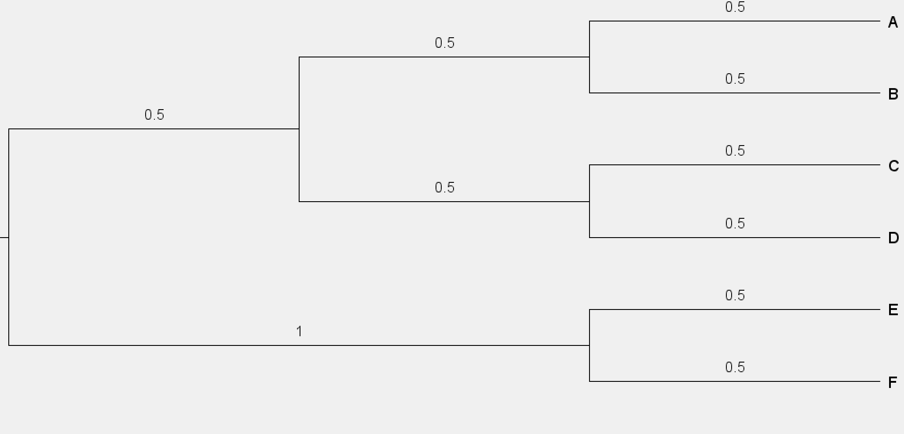
  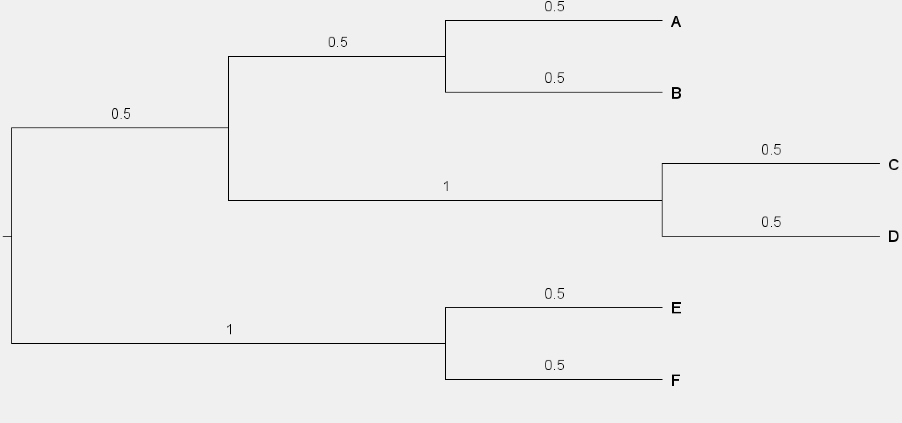

The estimated branches for the species tree are as shown below left. Note the longer branch is 0.75 - 50 gene trees are 0.5 for this branch and 50 gene trees are 1 for this branch. All gene tree branch lengths are used because all gene trees are congruent with the species tree. This is also reflected in the information tree shown below right, where all branch lengths are 100. 

  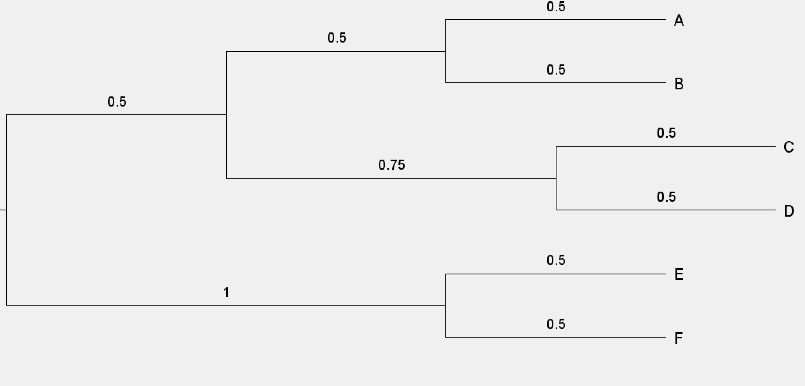
  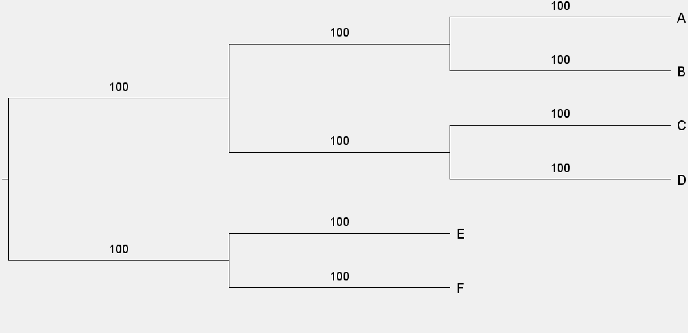

### Simple case with some incongruence
There are 100 gene trees, 50 are like the one on the left, 50 are like the one on the right. The species tree has the branching order/topology of the tree on the left i.e. the tree on the right is inconrgurent with species tree.

  
  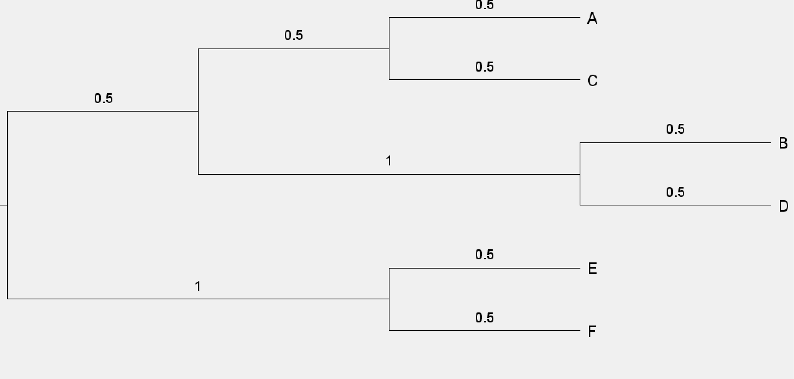

Therefore in this case, the longer branch in the incongruent gene tree does not contribute to the estimate of any branch length in the species tree. Note this is also represented in the information tree where only 50 trees contribute branch lenght information in the ((A,B),(C,D)).

  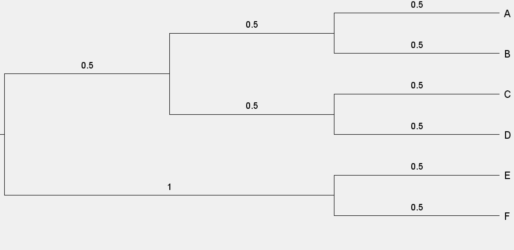
  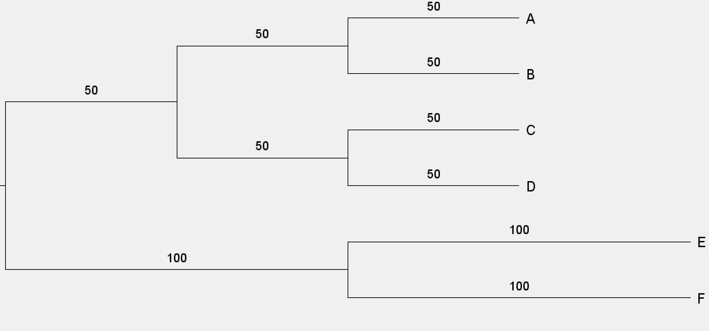

### Another case with some incongruence
In this case, we have a different pattern of incongruence. Same situation, 50 gene trees are incongruent, 50 are congruent.

  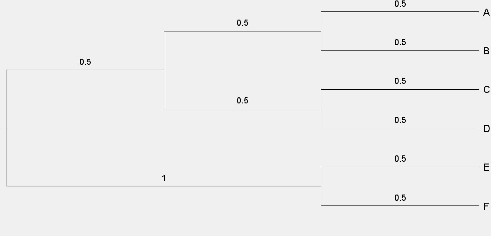
  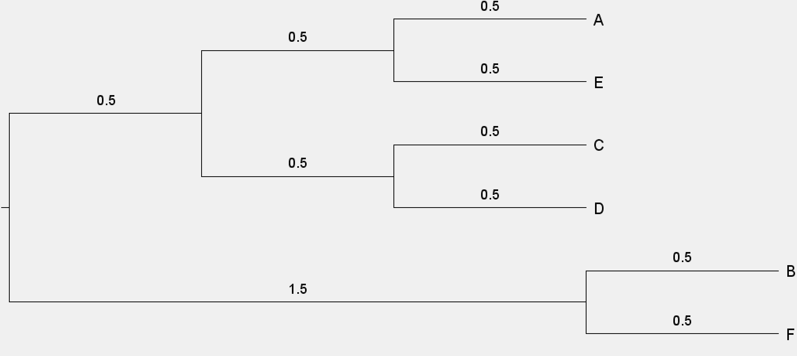

The incongruent clade is subtended by the longer branch but is ignored when calculating the branch lengths in the species tree. Note how there are a lot of 50s in the information tree. This is because all these branches are all impacted by the incongruence.

  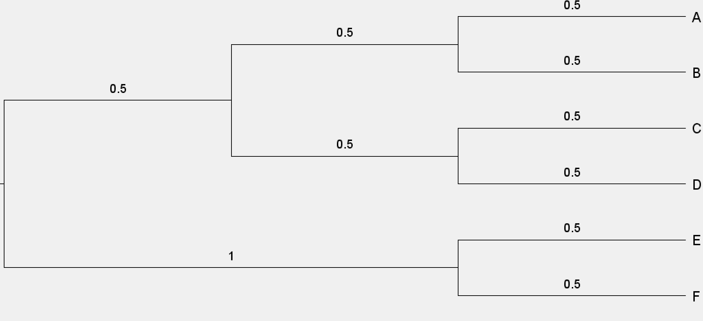
  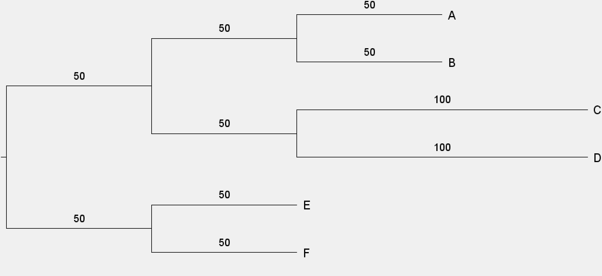

### Limited sampling that does not matter
The species tree is a little bigger. Consider the branch subtending the clade of ((C1,C2),(D1,D2)). 50 of the gene trees only have C1 and D1.

  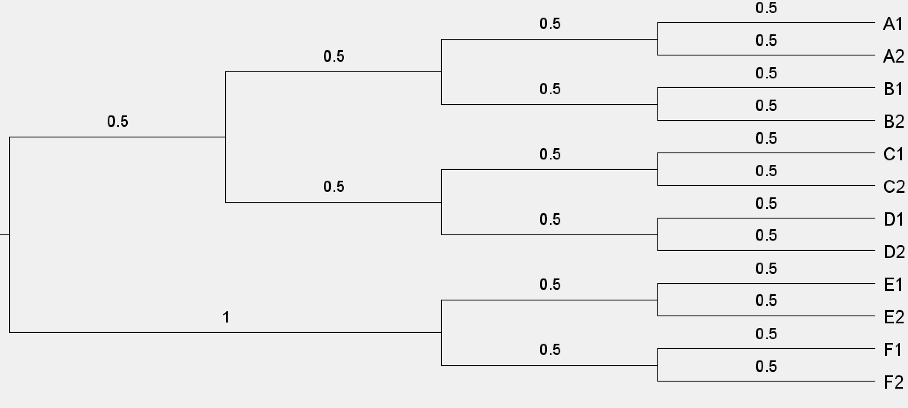
  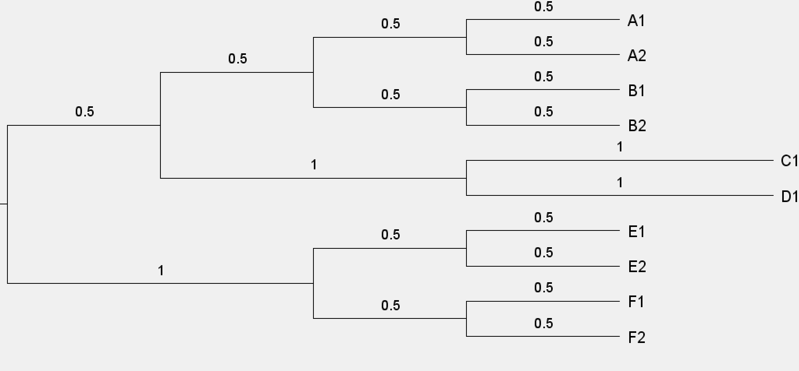

The trees with C1 and D1 are still used for estimating the length of the branch subtending ((C1,C2),(D1,D2)) in the species tree. As such, that branch has a length of 0.75 in thespecies tree (0.5 in the fully sampled tree, and 1 in the incompletely sampled tree). You can see what is going on in the information tree too.

  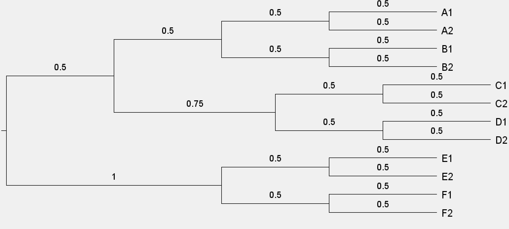
  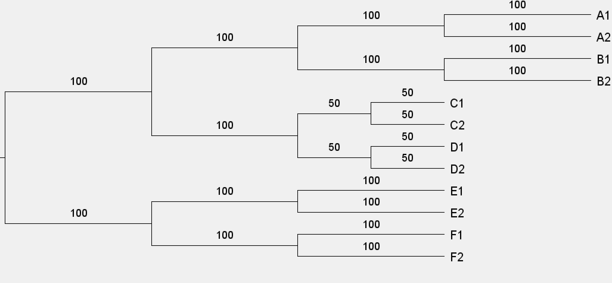

### Limited sampling that does matter
In this case there is also limited sampling in half the gene trees. The limited sampling tree is missing D1 and D2.

