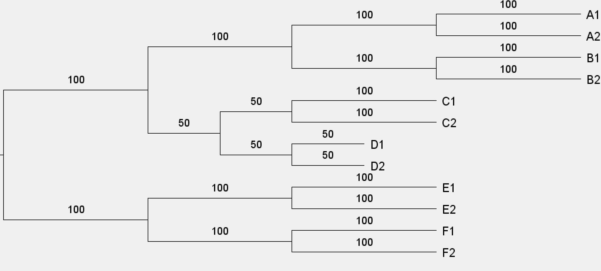
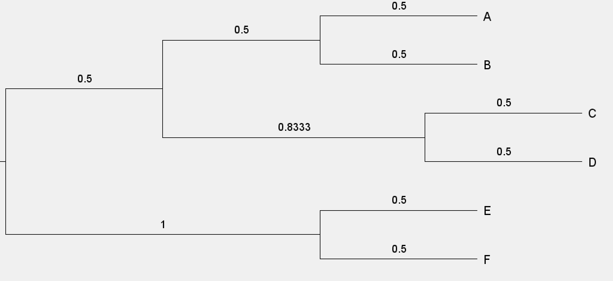

# GetCongruentBranches
This is a user-friendly version of the "congruent branches" method we introduced in [Carruthers et al. 2022](https://doi.org/10.1093/sysbio/syac012) page 1130. It is also used in the study of the mountain flowering plant genus *Saxifraga* in [Carruthers at al. 2024](https://doi.org/10.1038/s41467-024-45289-w).

The method works by searching for branches accross all gene trees that are congruent with each species tree branch. Species tree branch lengths are then calculated as the mean accross all gene tree branches that are congruent with that species tree branch. There are some simple worked examples below.   

This method is useful because often there is not a single gene tree entirely congruent with the species tree. Therefore, just selecting the loci with gene trees that are most congruent with the species tree, as in SortaDate, can be a problem, because these gene trees often still have quite a lot of incongruence.  

There is one function: `get_congruent_branch_length_tree`   
`get_congruent_branch_length_tree(species_tree_name,`  
`  gene_tree_directory,`  
`  zero_sample_overrule,`  
`  loci_lengths,`  
`  output_tree_name)`  

## Usage 
`species_tree_name` the file name of the species tree on which you will map the branch lengths  
`gene_tree_directory` the directory in which your gene trees are located  
`zero_sample_overule` TRUE will continue to output branch lengths even if there are no gene trees congruent for one or more species tree branches. Such branches will have a length of 0. If FALSE it will exit.  
`loci_lengths` This can just be set as 1, in which case every gene tree is treated equally. Alternatively, a named vector of the length of the alignment for each gene tree can be used (or any other criteria on which you might want to weight the gene trees). names(loci_length) should be the file name of the relevent gene tree. This allows a weighted mean to be estimated.  
`output_tree_name` file name for output branch length tree. A further "information tree" will also be written. On this tree, the branch lengths correspond to the number of gene trees that provided information for a given species tree branch. i.e. the number that were congruent.  

It requires phytools.

The method can be used with any type of branch length. Although as discussed in [Carruthers et al. 2022](https://doi.org/10.1093/sysbio/syac012), if using with time branch lengths the output tree will not necessarily be ultrametric. Therefore the method is probably more useful to get molecular branch lengths, or perhaps rates, before inputting the tree it produces into something like treePL in order to get divergence times. 

## Some simple worked examples
These are not necessarily biologically realistic. They are just illustrative of how the method works.
### No incongruence
There are 100 gene trees, 50 are like the one on the left, 50 are like the one on the right. The species tree has the same branching order/topology as these gene trees.

  
  

The estimated branches for the species tree are as shown below left. Note the longer branch is 0.75 - 50 gene trees are 0.5 for this branch and 50 gene trees are 1 for this branch. All gene tree branch lengths are used because all gene trees are congruent with the species tree. This is also reflected in the information tree shown below right, where all branch lengths are 100. 

  
  

### Simple case with some incongruence
There are 100 gene trees, 50 are like the one on the left, 50 are like the one on the right. The species tree has the branching order/topology of the tree on the left i.e. the tree on the right is inconrgurent with species tree.

  
  

In this case, the longer branch in the incongruent gene tree does not contribute to the estimate of any branch length in the species tree. Note this is also represented in the information tree where only 50 trees contribute branch lenght information in the ((A,B),(C,D)) clade.

  
  

### Another case with some incongruence
In this case, we have a different pattern of incongruence. As before 50 are congruent with the species tree (below left), and 50 are incongruent with the species tree (below right).

  
  

The incongruent clade is subtended by the longer branch but is ignored when calculating the branch lengths in the species tree. Note how there are a lot of 50s in the information tree. This is because all these branches are impacted by incongruence.

  
  

### Limited sampling that does not matter
The species tree is a little bigger. Consider the branch subtending the clade of ((C1,C2),(D1,D2)). 50 of the gene trees only have C1 and D1 (below right).

  
  

The trees with C1 and D1 are still used for estimating the length of the branch subtending ((C1,C2),(D1,D2)) in the species tree. As such, that branch has a length of 0.75 in the species tree (it is 0.5 in the fully sampled tree, and 1 in the incompletely sampled tree). You can see what is going on in the information tree too.

  
  

### Limited sampling that does matter
In this case there is also limited sampling in half the gene trees. The limited sampling tree is missing D1 and D2. 50 gene trees are like this (below right), 50 are fully sampled (below left).

  
  

The limited sampling tree does not provide any useful information about the branch subtending the clade of ((C1,C2),(D1,D2)). It therefore does not contribute to the estimation of branch lengths in the species tree. Again, the information tree can be useful for seeing what is going on.

  
  

### An example with the weighted mean option
This has the same gene tree topologies as for the first example. However, the gene trees with the long branch subtending (C,D) are estimated from loci with 200 sites. The other gene trees by contrast are estimated from loci with 100 sites. You can weight the branch length estimates according to this (i.e. give more weight to gene trees estimated from longer partitions). When you do this you get the result shown below.

  
  

In this case the branch lengths in the information tree are the number of loci multiplied by the length of the loci.

